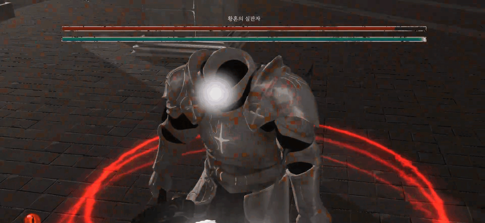
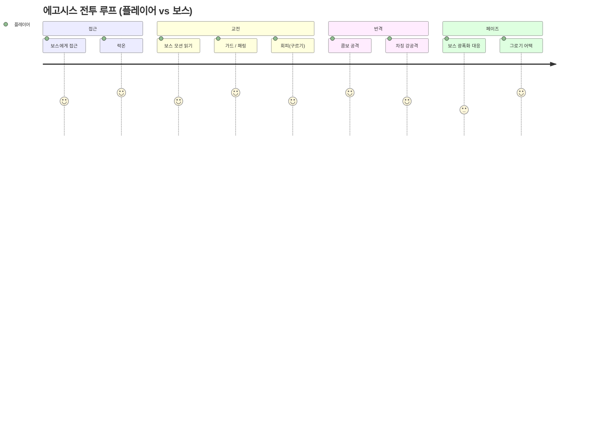
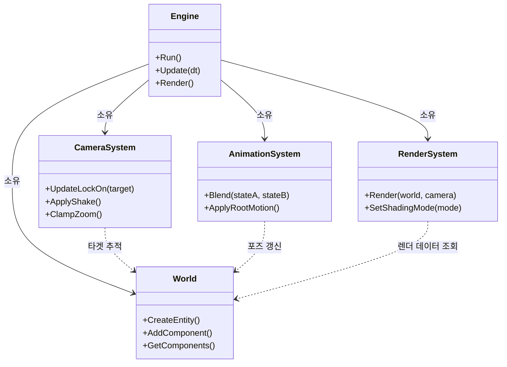
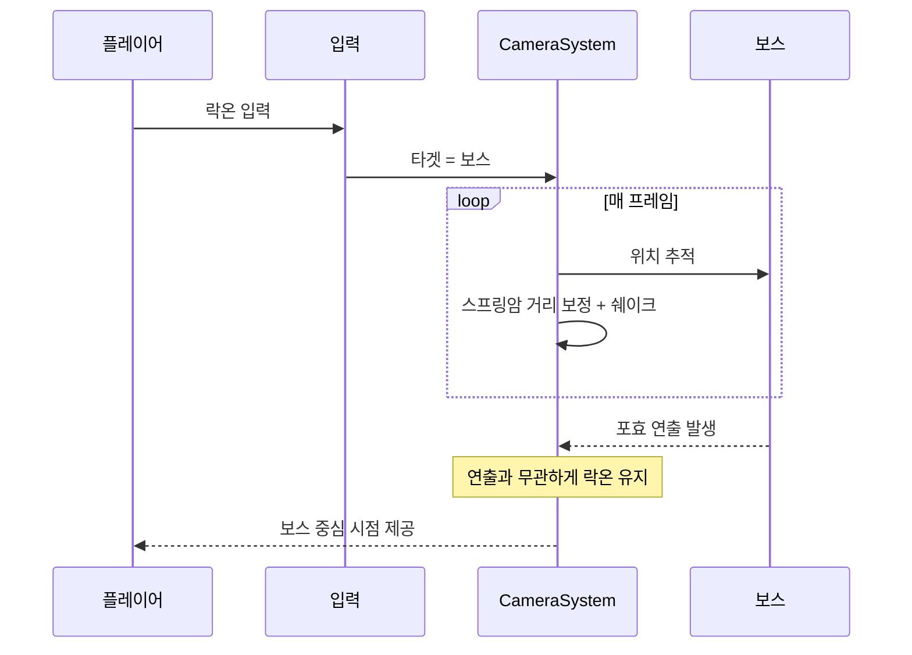
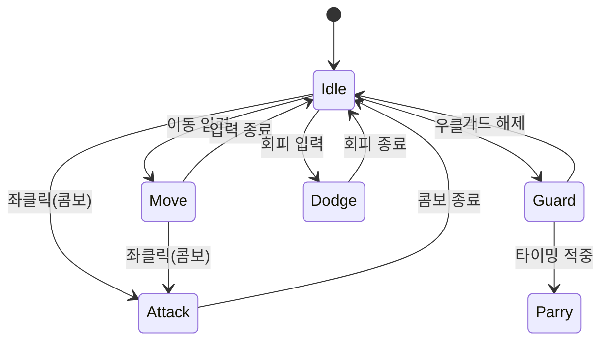
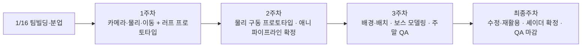

# 에고시스 (EGOSIS) — 자체 엔진 기반 3인칭 소울라이크 액션

> 팀이 직접 만든 C++ · Direct3D 11 엔진(Alice Engine) 위에서 개발한 3인칭 소울라이크 액션 게임입니다.
> 단일 보스전을 중심으로 패링·가드·회피·콤보 전투를 구현했고 저는 팀 리더 프로그래머로서 카메라·애니메이션·렌더링과 프로토타입 조립·빌드를 맡았습니다.

## Project Snapshot

| 항목 | 내용 |
|---|---|
| 프로젝트 | 에고시스(Egosis) · 3인칭 소울라이크 액션 (단일 보스전) |
| 프로젝트 유형 | 팀 프로젝트 (학기 게임 프로젝트) · 팀명 "낫놓고 게임즈" |
| 개발 기간 | 2026.01.16 ~ 2026.02.13 (약 3주) |
| 팀 규모 | 8명 — 프로그래머 4 (본인 팀 리더) · 아트 2 · 기획 2 |
| 내 역할 | 팀 리더 / 프로그래머 — 카메라·락온, 애니메이션·블렌딩·FBX 분리, 렌더링·톤매핑(Toon PBR), 프로토타입 조립·빌드/Git 관리 |
| 플랫폼 | Windows (Win32, Direct3D 11) |
| 기술 스택 | `C++20` `Direct3D 11` `HLSL` `NVIDIA PhysX` `RTTR` `Dear ImGui` `CMake/vcpkg` `Assimp` |
| 협업 | 주간 정기회의 · QA 리스트(70+ 항목) · Git + SVN · 빌드 배포 |

> 캐릭터 "티아(Tia)", 무기 "에고웨폰(낫)". 엔진 내부 렌더러 이름은 AliceRenderer이며 자체 Toon PBR 셰이딩을 사용합니다.
> 테스트 환경(OS·GPU)과 데모 링크는 [추후 보강할 내용](#추후-보강할-내용)에 정리했습니다.

---

# 왜 만들었나

상용 엔진의 컴포넌트를 조합하는 방식만으로는 렌더링·애니메이션·물리·리소스 로딩 같은 하부 동작이 블랙박스로 남아, 문제가 생겨도 원인을 추적하기 어려웠습니다. 팀은 학기 동안 준비한 자체 엔진(Alice Engine) 위에서 실제로 플레이 가능한 게임을 만들기로 했고 특히 **소울라이크 전투의 손맛**(패링·가드·회피·콤보)을 직접 구현하며 엔진과 게임플레이가 맞물리는 지점을 검증하고자 했습니다.

3주라는 짧은 기간이었기 때문에, 새 기능을 무한히 붙이기보다 **단일 보스전 하나를 끝까지 완성도 있게 다듬는 것**을 목표로 삼았습니다. 저는 팀 리더로서 각 파트의 모듈을 하나의 플레이 가능한 빌드로 조립하고 전투가 잘 보이도록 카메라·애니메이션·렌더링을 담당했습니다.

---

# 내가 맡은 시스템

전투가 "잘 보이고 잘 읽히도록" 만드는 데 필요한 시스템을 담당했습니다.

## 1. 카메라 · 락온

플레이어가 보스를 계속 화면에 두고 싸울 수 있도록 락온과 카메라 연출(쉐이크·무빙)을 구현했습니다.

- 입력: 플레이어/보스 Transform, 마우스·패드 입력
- 처리: 락온 타겟 추적, 스프링암으로 거리 보정, 타격 시 쉐이크
- 결과: 보스를 향한 시점 고정과 전투 가독성
- 옵션: 줌 인/아웃 한계, 락온 토글

## 2. 애니메이션 · 블렌딩 · FBX 분리

캐릭터 동작을 자연스럽게 잇기 위해 FBX 애니메이션을 분리·정리하고 상태 간 블렌딩을 구성했습니다.

- 입력: 믹사모→FBX→블렌더 파이프라인으로 정리한 애니메이션 클립
- 처리: 클립 분리, 상태 전이 블렌딩, 루트모션 연결
- 결과: Idle·이동·공격·가드·회피가 끊김 없이 연결
- 옵션: 클립별 재생 속도, 전이 시간

## 3. 렌더링 · 톤매핑(Toon PBR) · 셰이더

게임의 톤을 잡는 셰이딩과 포스트프로세스를 맡았습니다.

- 입력: 머티리얼 파라미터, 조명·스카이박스 설정
- 처리: 자체 Toon PBR 셰이딩, 톤매핑, 셰이더 파라미터 조정
- 결과: 캐릭터가 배경과 또렷하게 분리되는 화면
- 옵션: 셰이딩 모드 전환(Toon PBR / 램버트 등)

## 4. 프로토타입 조립 · 빌드 / Git 관리

전투·물리·UI·VFX 등 각자 작업한 모듈을 하나의 플레이 가능한 빌드로 통합하고 팀의 버전 관리를 운영했습니다.

- 처리: 프로토타입 메인 씬 조립, 최종 엔진 빌드/버전 관리, Git 컨벤션·LFS·서브모듈 운영
- 결과: 주기적으로 팀 PC에 배포되는 실행 빌드(전투/UI 2종)
- 옵션: 빌드별 리소스 쿠킹·프리로드

---

# 개발 중 만난 문제와 해결

담당 영역(카메라·애니메이션·렌더링·빌드)에서 실제로 겪은 문제들입니다. QA 리스트와 회의 기록에 근거하며 문서에 해결 방식이 기록되지 않은 경우 그대로 밝혔습니다.

## 1. 포효 연출에서 락온이 풀렸다

**문제 상황**
보스의 첫 조우 포효와 2페이즈 포효에서 모두 락온이 풀렸습니다. 반면 그로기 어택 때는 락온이 유지됐습니다.

**해결**
연출(포효) 재생이 락온 상태를 강제로 해제하던 흐름을 분리해, 연출 중에도 타겟 고정이 유지되도록 수정했습니다(QA 최종 컨펌).

**설계 판단**
"연출 재생"과 "전투 입력 상태"를 같은 경로에서 처리하면 한쪽이 다른 쪽을 의도치 않게 끈다고 보고 락온 같은 전투 상태는 연출과 독립적으로 유지되도록 분리하는 쪽을 택했습니다.

## 2. 평타를 한 번 쳐야만 카메라가 움직였다

**문제 상황**
플레이어가 평타를 한 대 친 뒤에야 마우스 움직임이 카메라에 반영됐습니다. 클릭 전에는 시점 전환이 안 돼 부자연스러웠고 줌 인/아웃이 과도해 카메라가 얼굴 안으로 들어가기도 했습니다.

**해결**
컨트롤 입력으로 마우스 포인터를 숨기는 시점을 기준으로 카메라 조작을 활성화하도록 정리하고 줌 인/아웃에 한계값을 두었습니다(클릭 의존 제거, QA 완료).

**설계 판단**
카메라 활성 조건이 "공격 입력"에 묶여 있던 것을 "커서 상태"로 옮겨, 전투를 시작하지 않아도 시점을 잡을 수 있게 했습니다. 줌은 무제한 대신 상·하한을 둬 화면이 깨지는 경우를 막았습니다.

## 3. 디버그용 카메라 입력·미사용 카메라가 남아 있었다

**문제 상황**
`CameraController`에 숫자키(1~6)·b·L 등으로 디버그 카메라를 움직이는 레거시 입력이 남아 있었고 씬에는 쓰지 않는 카메라(2~5번)가 함께 있었습니다.

**해결**
`Update()`에서 디버그 입력 처리를 제거하고 씬의 미사용 카메라를 정리했습니다(02.12 완료).

**설계 판단**
프로토타입 단계의 임시 코드가 출시 빌드에 남으면 의도치 않은 입력·혼란을 부르므로, 빌드 정리 시점에 "쓰는 것만 남긴다"를 기준으로 레거시를 걷어냈습니다.

## 4. 그림자가 캐릭터를 한 프레임 늦게 따라와 떨렸다

**문제 상황**
그림자가 플레이어보다 살짝 늦게 따라와 덜덜 떨리는 것처럼 보였고 렌더링이 끊겨 보기 불편했습니다.

**해결 / 한계**
그림자(라이트·섀도우 행렬)가 캐릭터 Transform을 한 프레임 지연 추종하는 것이 원인으로 보고 보간 적용을 검토했습니다. 다만 기록상 보간이 최종 빌드에 반영됐는지는 확정되지 않았습니다(문서상 "그대로 갈 가능성"으로 남음). 이 항목은 [추후 보강](#추후-보강할-내용)에서 최종 처리 여부를 확인해 정리할 예정입니다.

**설계 판단**
렌더 데이터가 게임 로직보다 한 프레임 뒤처지는 동기화 순서 문제로 접근했고 무리하게 봉합하기보다 원인(업데이트 순서)을 우선 확인했습니다.

## 5. 막바지 셰이딩 방식을 결정해야 했다

**문제 상황**
최종 주차에 Toon PBR을 유지할지, 더 단순한 툰/램버트로 전환할지 당일 마감(21:00) 안에 결정해야 했습니다.

**해결**
게임 톤과 일정 리스크를 함께 보고 셰이딩 방식을 확정했습니다. 신규 기능 추가가 금지된 막바지였기에, 안정적으로 빌드되는 선택을 우선했습니다.

**설계 판단**
"더 좋은 그림"보다 "마감 안에 안정적으로 나오는 그림"을 택해야 하는 시점이라고 판단했습니다. 이미 갖춰진 셰이딩을 다듬는 방향으로 위험을 줄였습니다.

## 6. 흩어진 모듈을 하나의 플레이 빌드로 합쳐야 했다

**문제 상황**
전투·물리·UI·VFX를 각자 작업해, 합치는 과정에서 씬 전환 시 UI 빌드 누락, 빌드 간 동작 차이 같은 통합 문제가 생겼습니다.

**해결**
프로토타입 메인 씬을 기준으로 모듈을 조립하고 전투용·UI용 빌드 2종을 만들어 회의 직후 팀 PC에 배포했습니다. Git 컨벤션·LFS·서브모듈로 협업 충돌을 줄였습니다.

**설계 판단**
"각자 잘 도는 것"과 "합쳐서 도는 것"은 다르다고 보고 통합 빌드를 자주 만들어 일찍 문제를 드러내는 쪽을 택했습니다. 리더로서 빌드·버전 관리를 한 곳에서 맡아 기준점을 단일화했습니다.

---

# 핵심 기능 하이라이트

## 락온 카메라

**무엇을 하는 기능인가**
플레이어가 보스를 화면 중심에 두고 싸우도록 시점을 고정·추적합니다.

**왜 필요했나**
소울라이크 전투는 적의 모션을 읽고 반응해야 하므로, 보스가 항상 보이는 안정적인 시점이 필요했습니다.

**어떻게 구현했나**
락온 타겟을 추적하고 스프링암으로 거리를 보정하며 타격 시 쉐이크를 더합니다. 포효 등 연출 중에도 락온이 유지되도록 상태를 분리했습니다.

**사용자에게 보이는 결과**
보스를 놓치지 않고 패링·회피 타이밍을 읽을 수 있습니다.

## Toon PBR 렌더링

**무엇을 하는 기능인가**
자체 Toon PBR 셰이딩과 톤매핑으로 게임의 시각 톤을 잡습니다.

**왜 필요했나**
액션이 잘 읽히려면 캐릭터가 배경과 또렷하게 분리되어야 했습니다.

**어떻게 구현했나**
머티리얼 파라미터를 셰이더로 노출하고 셰이딩 모드와 톤매핑을 조정했습니다.

**사용자에게 보이는 결과**
보스전에서 캐릭터·무기 실루엣이 분명하게 보입니다.

## 애니메이션 블렌딩 · FBX 분리

**무엇을 하는 기능인가**
공격·가드·회피·이동 동작을 자연스럽게 잇습니다.

**왜 필요했나**
전이가 끊기면 입력이 씹히는 느낌이 들어 전투 손맛이 떨어집니다.

**어떻게 구현했나**
믹사모→FBX→블렌더 파이프라인으로 클립을 정리·분리하고 상태 전이에 블렌딩과 루트모션을 연결했습니다.

**사용자에게 보이는 결과**
동작 전환이 매끄럽게 이어집니다.

---

# 플레이어 전투 흐름

---

# 어떻게 만들었나 (엔진 계층)

게임은 자체 엔진 위에서 동작하며 엔진은 역할에 따라 계층으로 나뉩니다. 제가 담당한 부분을 함께 표시했습니다.

## 1. Engine / Loop Layer
프레임을 구동하고 모드를 전환합니다. (프로토타입 메인 조립 · 빌드 관리 — 본인)

## 2. Runtime / Domain Layer
ECS World, 스크립트, 물리(PhysX), 애니메이션·전투가 동작합니다. (애니메이션·블렌딩 — 본인 / 전투·물리 — 팀)

## 3. Rendering Layer
Direct3D 11로 Forward/Deferred 경로를 그리고 Toon PBR·톤매핑·카메라를 처리합니다. (렌더링·톤매핑·카메라 — 본인)

## 4. Resource / Tools Layer
리소스 로딩·직렬화·프리로드와 ImGui 에디터. (빌드·Git 운영 — 본인)

---

# 전체 구조 클래스 다이어그램

---

# 주요 기능 시퀀스 다이어그램

## 락온 카메라 흐름

이 다이어그램은 플레이어가 락온한 뒤, 연출 중에도 시점이 유지되는 과정을 보여줍니다.

## 플레이어 애니메이션 상태

이 다이어그램은 전투 입력에 따른 애니메이션 상태 전이를 보여줍니다.

---

# Before / After

성능 수치는 측정값이 없어 작성하지 않았습니다. 작업 방식·실수 가능성·확인 방식·유지보수 관점에서 비교합니다.

| 구분 | 기존 | 개선 후 |
|---|---|---|
| 카메라 활성 | 평타를 쳐야 카메라 조작 가능 | 커서 상태 기준 상시 활성, 줌 한계 적용 |
| 락온 | 포효 등 연출에 락온 풀림 | 연출과 분리해 락온 유지 |
| 레거시 코드 | 디버그 카메라 입력·미사용 카메라 잔존 | 빌드 정리 시 사용분만 남김 |
| 모듈 통합 | 파트별 분산 작업 | 프로토타입으로 조립한 통합 빌드 주기 배포 |
| 협업 | 충돌·대용량 파일 이슈 | Git 컨벤션·LFS·서브모듈로 정리 |

---

# 팀과 협업

8명(프로그래머 4·아트 2·기획 2)이 약 3주간 진행했고 저는 팀 리더 프로그래머였습니다.

- **역할 분담(프로그래밍)**: 카메라·애니메이션·렌더링·프로토타입 조립·빌드/Git(본인) / 전투·판정·FSM·물리(팀원) / UI·사운드·이펙트(팀원) / 포스트프로세스·보스 패턴·맵 배치(팀원)
- **회의**: 매주 월요일 정기회의로 진행 상황·계획 공유(1주차~최종주차, 전원 참석)
- **QA**: 별도 QA 리스트로 전투·UI·렌더링·사운드 버그/요청 70여 건을 항목화해 추적
- **버전 관리**: 코드는 Git(컨벤션·LFS·서브모듈), 산출물은 SVN으로 병행 관리
- **빌드 배포**: 전투용·UI용 빌드 2종을 회의 직후 팀 PC에 배포해 통합 상태를 자주 확인

## 일정 요약

---

# 개선하면서 배운 점

기능을 빠르게 붙이는 것보다, 기능이 "언제·어디서 실행되는가"를 통제하는 일이 더 중요했습니다. 락온이 연출에 풀리거나, 카메라 활성 조건이 공격 입력에 묶여 있던 문제처럼, 상태와 트리거를 분리하는 것만으로 많은 버그가 사라졌습니다.

또한 팀 리더로서 통합 빌드를 자주 만들고 버전 관리 기준을 단일화하니, 합치는 단계에서 터지는 문제를 일찍 발견할 수 있었습니다. 3주라는 짧은 일정에서는 "더 좋은 기능"보다 "마감 안에 안정적으로 도는 빌드"를 택하는 판단이 결과적으로 완성도를 지켜 주었습니다.

---

# 추후 보강할 내용

- 락온 카메라와 Toon PBR 렌더링의 실제 플레이 화면. 파일이 없어 자리표시자 링크는 지웠다
- 그림자 떨림(보간) 항목의 최종 빌드 반영 여부 확정
- 테스트 환경(OS·GPU)과 빌드/실행 방법, 데모 영상·플레이 빌드 링크
- 본인 담당과 다른 프로그래머 역할 경계의 구체적 분담 표
- 코드 규모·기여 커밋 등 정량 지표(확정 후 기재)
