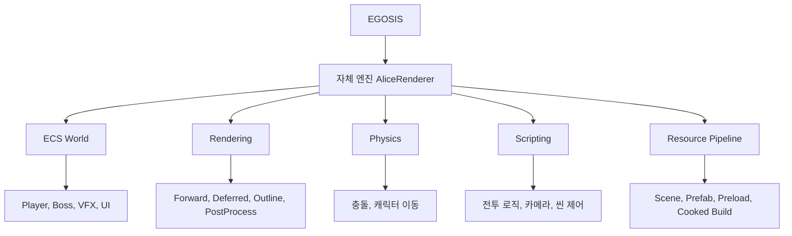
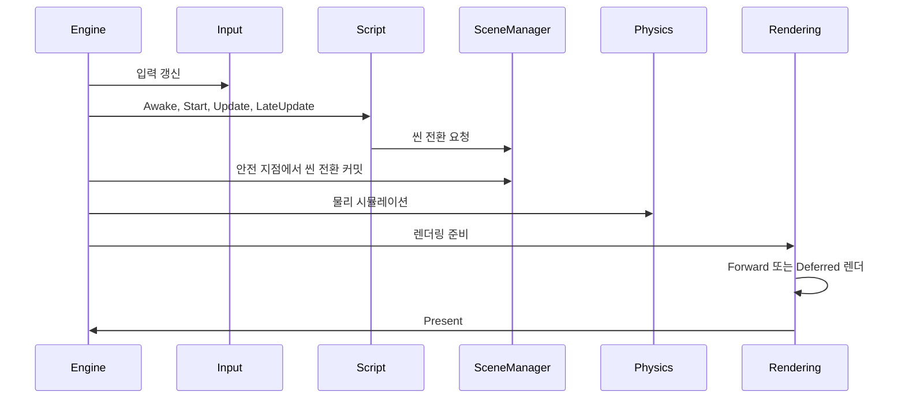
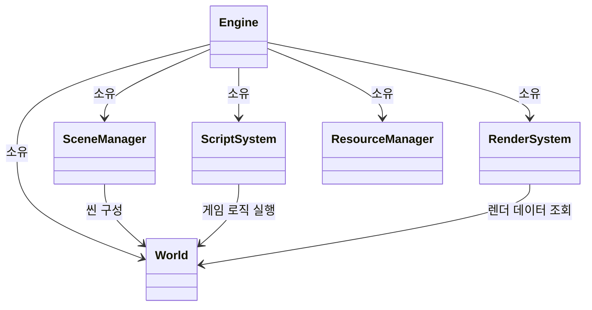
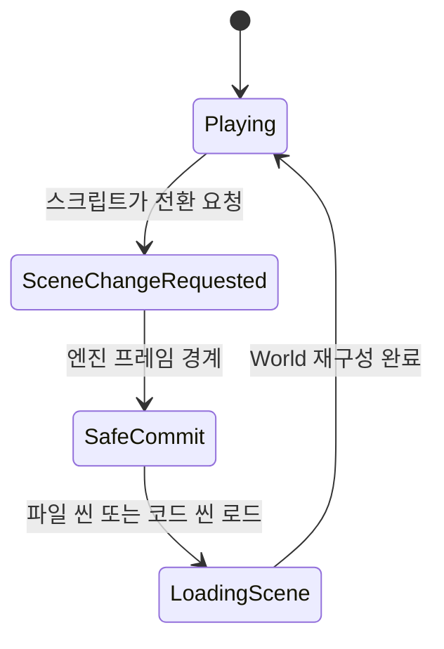
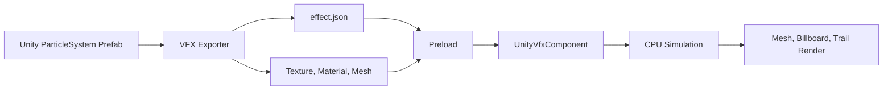

# EGOSIS 포트폴리오 설명

EGOSIS는 자체 제작 3D 엔진 AliceRenderer로 만든 소울라이크 전투 프로젝트입니다. 엔진의 핵심 구조부터 렌더링, 애니메이션, VFX, 씬 전환, 리소스 로딩, 에디터 기능까지 직접 구현해 플레이 가능한 전투 경험으로 연결했습니다.

## 한 줄 소개

자체 엔진으로 소울라이크 전투를 만들며 게임플레이와 엔진 시스템을 함께 설계한 프로젝트입니다.

## 왜 만들었는가

상용 엔진 기능을 단순히 사용하는 것보다, 3D 게임이 내부에서 어떻게 동작하는지 직접 이해하고 싶었습니다. 특히 소울라이크 전투에 필요한 캐릭터 제어, 타격 연출, 애니메이션 기반 이동, 보스 전투, VFX, 씬 로딩을 직접 만들며 엔진과 게임플레이가 연결되는 지점을 확인하고자 했습니다.

## 어떻게 만들었는가

- ECS 기반 World를 만들고 Entity와 Component를 Sparse Set으로 관리했습니다.
- D3D11 기반 Forward와 Deferred 렌더러를 구현했습니다.
- PhysX와 ECS를 연결해 캐릭터와 충돌 처리를 구성했습니다.
- 스크립트 DLL과 핫리로드를 만들어 게임 로직을 빠르게 수정할 수 있게 했습니다.
- SceneManager는 씬 전환 요청을 모았다가 프레임 안전 지점에서 커밋하도록 설계했습니다.
- ResourceManager와 Preload 시스템으로 에디터와 최종 빌드의 로딩 경로를 통일했습니다.
- Unity ParticleSystem 데이터를 변환해 자체 엔진에서 VFX를 재생하는 파이프라인을 만들었습니다.

## 전체 구조

## 엔진 루프

## 핵심 클래스 관계

## 씬 전환 상태

## VFX 파이프라인

## 문제 상황과 해결 방법

| 문제 상황 | 해결 방법 |
| --- | --- |
| 스크립트 실행 중 씬을 즉시 바꾸면 World가 중간에 정리되어 불안정해질 수 있었습니다. | 씬 전환을 요청과 커밋으로 나누고 엔진 프레임 경계에서만 실제 전환하도록 만들었습니다. |
| Unity VFX를 단순 계산 이펙트로 옮기면 텍스처, 머티리얼, 트레일이 빠져 검기 연출이 점이나 큐브처럼 보였습니다. | Unity 데이터를 effect.json으로 추출하고 자체 VFX 렌더러에서 Mesh, Billboard, Trail을 직접 재현했습니다. |
| Root Motion을 그대로 적용하면 애니메이션 되감김, 소켓 불일치, 이동 폭주가 생길 수 있었습니다. | 루트 이동을 추출하고 포즈에서는 제거한 뒤, 필요한 경우에만 캐릭터 Transform에 적용했습니다. |
| 최종 빌드에서 큰 리소스를 처음 만날 때 끊김과 누락 위험이 있었습니다. | Preload.json과 로딩 화면을 만들어 필요한 리소스를 시작 단계에서 미리 로드했습니다. |
| 같은 이름의 FBX가 여러 개 있으면 잘못된 메시나 애니메이션이 연결될 수 있었습니다. | FBX 메타 에셋과 해시 키를 사용해 충돌을 피하고 프리팹 로딩 시 경로를 보정했습니다. |
| 포스트프로세스 기능 확장 중 상수버퍼 크기 불일치로 렌더링 이상 가능성이 있었습니다. | Forward와 Deferred 모두 동일한 PostProcess 구조체 크기를 기준으로 버퍼를 생성하도록 수정했습니다. |
| 스크립트 프로젝트에서 컴포넌트 타입 누락과 빌드 에러가 반복되었습니다. | 스크립트 전용 PCH와 공통 헤더 정리를 통해 컴포넌트 접근성과 빌드 안정성을 높였습니다. |

## 플레이 경험을 위해 집중한 부분

- 보스와 플레이어가 서로의 공격 타이밍을 읽을 수 있도록 전투 흐름을 구성했습니다.
- 카메라, 타격 VFX, 아웃라인, 포스트프로세스를 묶어 액션이 잘 보이도록 만들었습니다.
- 에디터에서 씬, 프리팹, 머티리얼, 로딩 목록을 조정할 수 있게 해 반복 작업 시간을 줄였습니다.
- 최종 실행 파일에서도 에디터와 같은 논리 경로로 리소스를 불러오도록 정리했습니다.

## 평가와 피드백

이 프로젝트는 자체 엔진으로 게임을 만들며 렌더링과 전투 로직만이 아니라 제작 파이프라인까지 직접 설계했다는 점을 보여줍니다. 단순 기능 구현보다 실제 전투 장면을 만들기 위해 필요한 안정성, 반복 작업 속도, 시각 피드백을 함께 개선한 프로젝트입니다.

Reddit 피드백은 아래 위치에 실제 댓글을 확인한 뒤 2문장으로 추가합니다. 공개용 문서에는 댓글 원문을 길게 붙이지 말고 게시글 링크와 핵심 피드백만 남기는 것이 좋습니다.

- 받은 반응: Reddit 댓글에서 확인된 장점 1개를 한 문장으로 작성합니다.
- 반영한 개선: 댓글 이후 바꾸었거나 다음 작업에 반영할 개선점 1개를 한 문장으로 작성합니다.

예시 형식:

- 받은 반응: 전투 연출과 보스전 분위기는 긍정적으로 보였고 공격 피드백을 더 명확히 하면 좋겠다는 의견을 받았습니다.
- 반영한 개선: 이후 카메라, 타격 VFX, 아웃라인, 포스트프로세스 연출을 중심으로 전투 가독성을 개선했습니다.

## 포트폴리오에 짧게 적는 문장

자체 제작 3D 엔진 AliceRenderer로 소울라이크 전투 게임 EGOSIS를 개발했습니다. ECS, D3D11 렌더링, PhysX 연동, 스크립트 핫리로드, 씬/리소스 시스템, VFX 파이프라인을 직접 구현했고 이를 보스 전투와 카메라 연출, 애니메이션 기반 이동, 최종 빌드 로딩 흐름까지 연결했습니다. 개발 중에는 씬 전환 안정성, VFX 재현, Root Motion, 리소스 프리로드, FBX 충돌 같은 문제를 해결하며 엔진 기능을 실제 게임 제작 흐름에 맞게 다듬었습니다.
