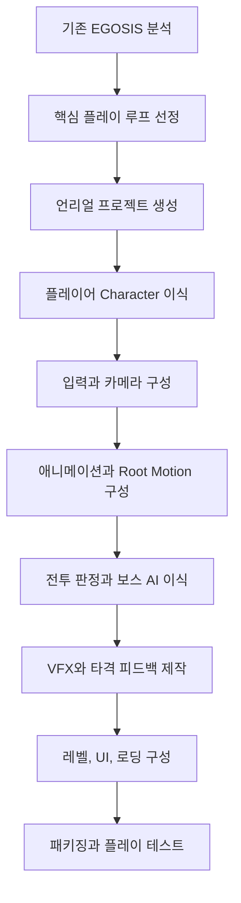
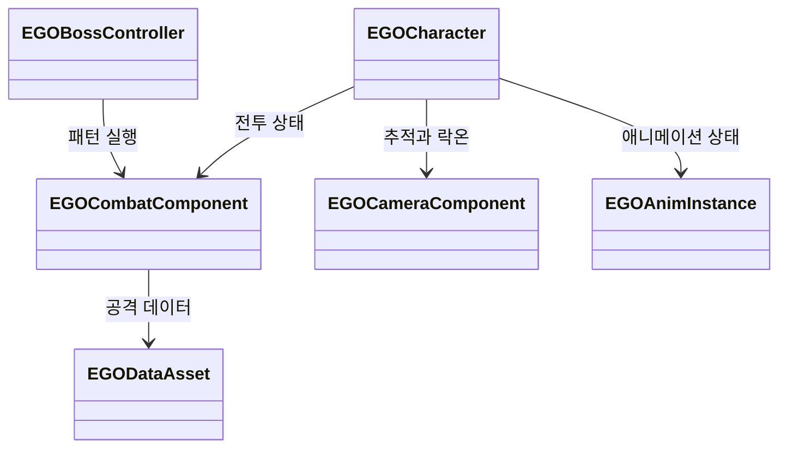
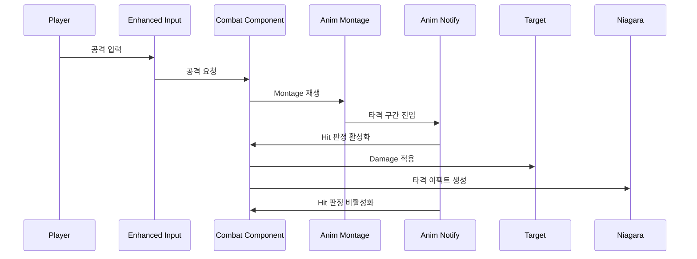
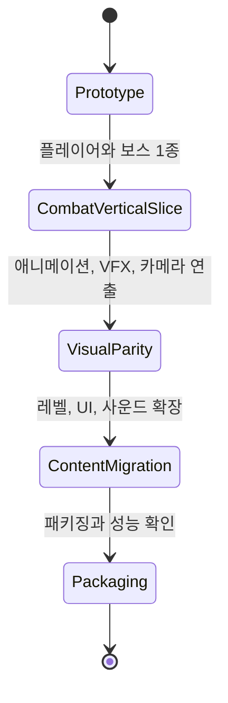

# EGOSIS 언리얼 엔진 포팅 계획

자체 엔진을 언리얼에서 그대로 다시 만드는 것이 아니라, EGOSIS의 전투 감각과 플레이 구조를 언리얼 기능 위로 옮기는 방식이 가장 현실적입니다. 엔진 시스템은 언리얼의 Actor, Component, Gameplay Framework, Enhanced Input, Animation Blueprint, Niagara, Level 시스템으로 치환하고 직접 만든 로직 중 게임의 정체성에 해당하는 전투, 보스 패턴, 카메라, 타격 피드백을 우선 이식합니다.

## 포팅 원칙

- 엔진 복제가 아니라 게임 이식으로 접근합니다.
- C++는 전투 판정, 상태 관리, 카메라, 세이브, 성능에 민감한 부분에 사용합니다.
- Blueprint는 튜닝, 연출, 레벨 배치, 빠른 반복 작업에 사용합니다.
- 기존 ECS 구조는 언리얼 Actor와 Actor Component 구조로 나눕니다.
- 기존 스크립트 컴포넌트는 언리얼 C++ Component 또는 Blueprint Component로 옮깁니다.
- 먼저 플레이어와 보스 1종으로 전투 루프를 만든 뒤, VFX와 레벨을 확장합니다.

## 시스템 대응표

| 자체 엔진 | 언리얼 대응 | 포팅 기준 |
| --- | --- | --- |
| World, Entity, Component | Actor, Actor Component, Scene Component | 엔티티 단위 오브젝트는 Actor로, 기능 단위 데이터와 로직은 Component로 이동 |
| GameObject 래퍼 | Actor API, Blueprint 노드 | 스크립트에서 자주 쓰던 조작은 Actor 함수로 정리 |
| SceneManager | Level, Open Level, Level Streaming | 씬 전환은 Level 단위로 재구성하고 필요한 경우 스트리밍 사용 |
| ResourceManager | Content Browser, Asset Manager, Data Asset | 리소스 경로 직접 로딩보다 에셋 참조와 데이터 에셋 중심으로 전환 |
| Prefab | Blueprint Class, Actor Blueprint | 반복 배치 오브젝트와 VFX 묶음은 Blueprint로 변환 |
| ScriptSystem | C++ Class, Blueprint, Actor Component | 전투 로직은 C++ 기반, 연출 연결은 Blueprint 허용 |
| InputSystem | Enhanced Input | 입력 액션과 매핑 컨텍스트로 플레이어 상태별 입력 분리 |
| Advanced Animation, Root Motion | Animation Blueprint, Montage, Root Motion | 공격, 회피, 피격은 Montage와 Notify 중심으로 재구성 |
| Unity VFX 파이프라인 | Niagara System | 검기, 충돌 이펙트, Trail은 Niagara로 다시 제작 |
| Forward, Deferred, PostProcess | 언리얼 렌더러, Material, Post Process Material | 자체 셰이더 기능은 머티리얼과 포스트프로세스 머티리얼로 치환 |
| PhysX 연동 | Chaos Physics, Character Movement | 캐릭터 이동은 Character Movement를 우선 사용하고 필요한 부분만 커스텀 |

## 전체 포팅 흐름

## 목표 구조

## 전투 처리 흐름

## 포팅 단계

1. 기준 버전과 템플릿 결정

언리얼 5 기반 Third Person 템플릿에서 시작합니다. 기존 EGOSIS의 전투를 먼저 재현해야 하므로 오픈월드나 대규모 레벨 구성은 뒤로 미룹니다.

2. 에셋 정리

FBX, 애니메이션, 텍스처, 사운드, VFX 원본을 언리얼 Content 폴더 규칙에 맞게 분리합니다. 기존 Resource와 Assets 경로는 언리얼 폴더 구조로 다시 매핑합니다.

3. 플레이어 캐릭터 구성

기존 플레이어 엔티티를 Character 클래스로 옮깁니다. 이동은 Character Movement를 우선 사용하고 회피나 공격 중 이동은 Root Motion 또는 Movement Lock으로 제어합니다.

4. 입력 이식

공격, 회피, 이동, 카메라, 락온을 Enhanced Input Action으로 나눕니다. 전투 상태에 따라 Mapping Context를 바꾸면 메뉴, 전투, 컷신 입력을 분리하기 쉽습니다.

5. 애니메이션 이식

이동은 Animation Blueprint와 Blend Space로 구성하고 공격과 회피는 Montage로 구성합니다. 타격 판정, VFX, 사운드는 Anim Notify로 연결합니다.

6. 전투 시스템 이식

기존 스크립트의 콤보, 피격, 데미지, 무적 시간, 보스 패턴을 Combat Component와 Data Asset으로 분리합니다. 먼저 플레이어 기본 공격 1세트와 보스 패턴 2개만 구현해 전투 루프를 검증합니다.

7. 카메라와 락온 이식

Spring Arm과 Camera Component를 사용해 기본 추적 카메라를 만들고 락온 시 타깃 방향 보정과 카메라 회전을 제어합니다. 기존 자체 엔진의 카메라 쉐이크와 FOV 연출은 Camera Manager 또는 Camera Shake로 옮깁니다.

8. VFX 이식

기존 Unity VFX 변환 파이프라인을 계속 유지하기보다, 언리얼에서는 Niagara로 다시 제작하는 편이 안정적입니다. 검기, 피격, 바닥 충돌, 보스 패턴 이펙트를 Niagara System으로 만들고 Montage Notify에서 스폰합니다.

9. 렌더링 연출 이식

Deferred Outline, HalfCut, 절단면 FX는 언리얼 Material과 Post Process Material로 다시 만듭니다. 자체 렌더러의 구조를 옮기기보다 화면에서 보이는 연출 단위로 재현합니다.

10. 레벨과 로딩 구성

기존 Scene 파일은 언리얼 Level로 재배치합니다. 반복 배치 오브젝트는 Blueprint Class로 만들고 시작 로딩은 Game Instance와 Level 전환 흐름에서 처리합니다.

## 상태별 작업 계획

## 먼저 옮길 기능

| 우선순위 | 기능 | 이유 |
| --- | --- | --- |
| 1 | 플레이어 이동, 회피, 공격 | 게임의 손맛을 가장 빨리 확인할 수 있음 |
| 2 | 보스 AI와 피격 판정 | 소울라이크 구조의 핵심 |
| 3 | Animation Montage와 Root Motion | 공격 거리와 타이밍을 안정적으로 맞추기 위함 |
| 4 | 카메라, 락온, 흔들림 | 전투 가독성과 조작감에 직접 영향 |
| 5 | Niagara VFX | 타격감과 외부 피드백 반영에 중요 |
| 6 | Post Process와 Outline | EGOSIS의 시각적 인상을 유지하기 위함 |

## 주의할 점

| 위험 | 대응 |
| --- | --- |
| 자체 ECS를 언리얼에 그대로 만들려는 시도 | Actor와 Component에 맞춰 구조를 단순화 |
| Root Motion 거리와 충돌 캡슐이 맞지 않음 | Montage별 Root Motion 적용 여부와 Capsule 이동을 따로 검증 |
| 기존 VFX와 Niagara의 모양이 다름 | 연출 목적을 기준으로 새로 제작하고 기존 영상은 레퍼런스로 사용 |
| 전투 로직을 Blueprint에 모두 넣어 복잡해짐 | 판정과 상태는 C++, 수치와 연출 연결은 Blueprint로 분리 |
| 첫 단계부터 모든 시스템을 옮기려 함 | 플레이어, 보스 1종, 테스트 맵 하나로 먼저 검증 |

## 선택 기준

Gameplay Ability System은 장기적으로 공격, 버프, 디버프, 쿨다운, 상태 이상이 많아질 때 유용합니다. 지금 목표가 포트폴리오용 포팅과 소울라이크 전투 재현이라면, 처음부터 Gameplay Ability System을 넣기보다 Combat Component와 Data Asset으로 작게 시작하는 편이 빠릅니다. 전투 규칙이 커지고 확장성이 필요해지는 시점에 Gameplay Ability System으로 옮기는 것이 좋습니다.

## 참고 자료

- [Unreal Engine Gameplay Framework](https://dev.epicgames.com/documentation/unreal-engine/gameplay-framework-in-unreal-engine?lang=en-US)
- [Actors in Unreal Engine](https://dev.epicgames.com/documentation/en-us/unreal-engine/actors-in-unreal-engine)
- [Enhanced Input](https://dev.epicgames.com/documentation/en-us/unreal-engine/enhanced-input-in-unreal-engine)
- [Animation Blueprints](https://dev.epicgames.com/documentation/unreal-engine/animation-blueprints-in-unreal-engine)
- [Animation Montages](https://dev.epicgames.com/documentation/unreal-engine/animation-montage-in-unreal-engine?lang=en-US)
- [Root Motion](https://dev.epicgames.com/documentation/en-us/unreal-engine/root-motion-in-unreal-engine?application_version=5.6)
- [Niagara VFX](https://dev.epicgames.com/documentation/unreal-engine/creating-visual-effects-in-niagara-for-unreal-engine)
- [Gameplay Ability System](https://dev.epicgames.com/documentation/unreal-engine/gameplay-ability-system-for-unreal-engine?lang=en-US)
