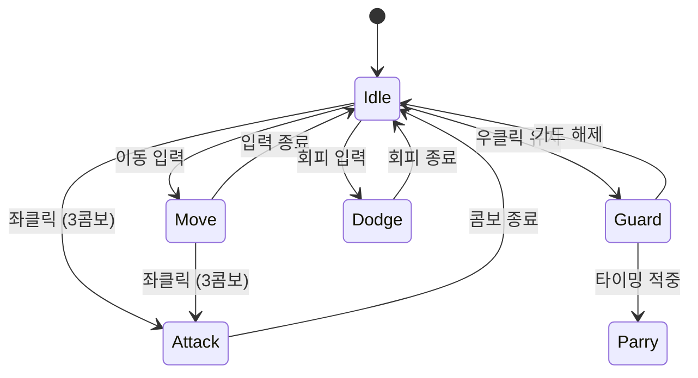

# EGOSIS — 자체 엔진 기반 3인칭 소울라이크 액션

> 팀이 직접 제작한 C++ · Direct3D 11 엔진(Alice Engine) 위에서 개발한 단일 보스전 3인칭 액션 게임입니다.  
> 패링·가드·회피·콤보 전투를 구현했고, 저는 팀 리더 프로그래머로서 카메라·애니메이션·렌더링과 프로토타입 조립·빌드를 맡았습니다.

<!-- 스크린샷 또는 플레이 영상 GIF -->


---

## Project Snapshot

| 항목 | 내용 |
|---|---|
| 장르 | 3인칭 소울라이크 액션 (단일 보스전) |
| 개발 기간 | 2026.01.16 ~ 2026.02.13 (약 3주) |
| 팀 규모 | 8명 — 프로그래머 4 · 아티스트 2 · 기획 2 |
| 내 역할 | 팀 리더 / 프로그래머 |
| 플랫폼 | Windows (Win32, Direct3D 11) |
| 엔진 | Alice Engine (자체 제작, C++20) |
| 기술 스택 | `C++20` `Direct3D 11` `HLSL` `NVIDIA PhysX` `RTTR` `Assimp` `FMOD` `Dear ImGui` `CMake/vcpkg` |

---

## 게임 소개

캐릭터 **티아(Tia)** 가 에고웨폰(낫)을 들고 단일 보스와 싸우는 3인칭 액션 게임입니다.  
소울라이크 장르 특유의 **모션 읽기 → 패링 / 가드 → 반격 → 콤보** 전투 루프를 중심으로 설계했으며, Toon PBR 셰이딩으로 캐릭터와 배경이 또렷하게 분리되는 비주얼을 목표로 했습니다.

### 전투 액션

| 액션 | 설명 |
|---|---|
| **패링** | 보스 공격 타이밍에 맞춰 반격 기회를 열기 |
| **가드** | 피해를 감소시키는 방어 자세 |
| **회피 (구르기)** | 무적 판정이 있는 회피 이동 |
| **3콤보 공격** | 연속 좌클릭으로 이어지는 콤보 체인 |
| **차징 강공격** | 천천히 모았다가 내리치는 고대미 일격 |
| **락온** | 보스를 화면 중심에 고정해 전투 가독성 확보 |
| **그로기 / 무기 파괴** | 보스 무기를 부수면 그로기 상태로 전환, 실행 공격 가능 |

---

## 주요 시스템 (내 담당)

### 카메라 · 락온

소울라이크 전투는 보스의 모션을 놓치지 않는 시점이 핵심입니다.  
락온 타겟을 스프링암으로 추적하고, 타격·이벤트에 따른 카메라 셰이크를 더했습니다.  
포효·컷씬 연출 중에도 락온 상태를 유지하도록 **연출과 전투 상태를 별도 경로로 분리**했습니다.

```
플레이어 락온 입력
  └─ CameraSystem: 타겟 = 보스
       ├─ 매 프레임: 스프링암 거리 보정 + 셰이크
       └─ 포효 연출 발생 → 락온 상태는 독립 유지
```

### Toon PBR 렌더링 · 셰이더

Direct3D 11 기반 Forward / Deferred 이중 렌더링 경로 위에서 **자체 Toon PBR 셰이딩**을 구현했습니다.  
Lambert, Phong, Blinn-Phong, Toon, PBR, **Toon PBR**, OnlyTexture 등 셰이딩 모드를 머티리얼 파라미터로 전환할 수 있으며, Sobel 엣지 디텍션으로 Deferred 아웃라인을 더했습니다.

```
머티리얼 파라미터 → Toon PBR 셰이더 → 톤매핑 / 포스트프로세스 → 화면 출력
                                       └─ Deferred Sobel 아웃라인
```

### 애니메이션 블렌딩 · FBX 파이프라인

믹사모 → FBX → 블렌더 파이프라인으로 클립을 분리·정리하고, 상태 전이에 **블렌딩과 루트모션**을 연결했습니다.  
Idle·이동·공격·가드·회피가 끊김 없이 이어지도록 전이 시간과 재생 속도를 조정했습니다.



### 프로토타입 조립 · 빌드 / Git 관리

전투·물리·UI·VFX를 각자 작업한 모듈을 **주기적인 통합 빌드**로 조립해 회의 직후 팀 PC에 배포했습니다.  
Git 컨벤션·LFS·서브모듈을 운영해 협업 충돌을 줄이고, 전투용·UI용 2종 빌드를 유지했습니다.

---

## Alice Engine 구조

게임은 팀이 직접 만든 자체 엔진(Alice Engine) 위에서 동작합니다.

```
┌─────────────────────────────────────────────────────┐
│  Editor Layer    ImGui 에디터 · 인스펙터 · 뷰포트       │
├─────────────────────────────────────────────────────┤
│  Runtime Layer   ECS · 스크립팅 · 물리 · 애니메이션     │
├─────────────────────────────────────────────────────┤
│  Rendering Layer D3D11 · Toon PBR · 카메라 · 쉐도우   │
├─────────────────────────────────────────────────────┤
│  Foundation      리소스 · 직렬화 · 입력 · 오디오        │
└─────────────────────────────────────────────────────┘
```

| 서브시스템 | 내용 |
|---|---|
| **ECS** | Sparse Set 기반 World / ComponentRegistry, Unity 스타일 GameObject 래퍼 |
| **렌더링** | Forward + Deferred 이중 경로, Toon PBR, Shadow Map (PCF), Post-Process Volume |
| **물리** | NVIDIA PhysX 래퍼 — RigidBody, Collision, Joint, Ragdoll |
| **애니메이션** | FBX 스켈레탈, 루트모션, 블렌딩, AnimBlueprint 상태머신, 소켓 어태치 |
| **스크립팅** | C++ 핫리로드 DLL (AliceScripts), RTTR 리플렉션으로 인스펙터 연동 |
| **오디오** | FMOD 기반 3D 공간음향, 이벤트 드리븐 SFX / BGM |
| **VFX** | 파티클, 트레일, 컴퓨트 이펙트, 데칼 시스템 |
| **UI** | 셰이더 기반 AliceUI 렌더러 (게임용), Dear ImGui (에디터용) |
| **에디터** | Hierarchy / Inspector / Project 브라우저 / 머티리얼 에디터 / AnimBlueprint 에디터 / Undo-Redo |

---

## 개발 중 해결한 주요 문제

### 포효 연출에서 락온이 풀렸다

보스의 포효 연출이 락온 상태를 강제로 해제하던 흐름을 분리해, 연출 중에도 타겟 고정이 유지되도록 수정했습니다.  
**"연출 재생"과 "전투 입력 상태"를 같은 경로에서 처리하면 한쪽이 다른 쪽을 의도치 않게 끈다**고 보고, 락온 상태를 연출과 독립적으로 관리했습니다.

### 평타 한 대를 쳐야 카메라가 반응했다

카메라 활성 조건이 "공격 입력"에 묶여 있던 것을 "커서 상태"로 옮겨, 전투 전에도 시점을 잡을 수 있게 했습니다.  
줌에 상·하한을 두어 카메라가 캐릭터 안으로 파고드는 문제도 함께 수정했습니다.

### 흩어진 모듈을 하나의 플레이 빌드로 합쳐야 했다

"각자 잘 도는 것"과 "합쳐서 도는 것"은 다르다고 보고, 통합 빌드를 자주 만들어 일찍 문제를 드러내는 쪽을 택했습니다.  
프로토타입 메인 씬을 기준으로 모듈을 조립하고, 전투용·UI용 빌드 2종을 회의 직후 팀 PC에 배포했습니다.

### 막바지 셰이딩 결정

신규 기능 추가가 금지된 최종 주차에 셰이딩 방식을 당일 확정해야 했습니다.  
"더 좋은 그림"보다 "마감 안에 안정적으로 나오는 그림"을 택해, 이미 갖춰진 Toon PBR을 다듬는 방향으로 위험을 줄였습니다.

---

## 빌드 방법

### 요구사항

- Windows 10/11
- Visual Studio 2019 / 2022 / 2026 (C++ 데스크톱 개발 워크로드)
  - 여러 버전이 깔려 있으면 `Build.bat`이 실행 시 어느 것으로 빌드할지 물어봅니다.
  - 묻지 않고 지정하려면 `Build.bat 2026` 처럼 연도나 목록 번호를 인자로 넘기면 됩니다.
- CMake 3.20+ (없으면 Build.bat이 선택한 VS의 번들을 쓰거나 winget으로 자동 설치)
- Git (서브모듈 포함)
- vcpkg (`C:\vcpkg` 또는 `D:\vcpkg`, 또는 `VCPKG_ROOT` 환경변수)

### 빌드

```batch
Build.bat
```

1. Git 서브모듈 업데이트
2. vcpkg로 라이브러리 설치 (DirectXTK, DirectXTex, Assimp, PhysX)
3. Visual Studio 선택 (설치된 것이 하나면 자동)
4. CMake로 VS 솔루션 생성 → `build/AliceRenderer.sln*`

### 솔루션 구성

| 솔루션 | 용도 |
|---|---|
| `build/AliceRenderer.sln*` | 에디터(`Launch`) / 게임(`AlicePlayer`) 빌드 |
| `EngineSource/ScriptsBuild/build/AliceUserScripts.sln*` | 게임 스크립트 핫리로드 DLL 빌드 |

솔루션 확장자는 빌드에 쓴 Visual Studio를 따라갑니다. 2022는 `.sln`, 2026은 새 XML 포맷인
`.slnx`를 생성합니다. `Build.bat`이 마지막에 실제 생성된 파일 경로를 출력하니 그대로 열면 됩니다.

---

## 팀 구성

| 파트 | 인원 | 주요 담당 |
|---|---|---|
| 프로그래밍 (본인, 팀 리더) | 1 | 카메라·락온, 애니메이션·블렌딩, 렌더링·Toon PBR, 프로토타입 조립, 빌드/Git |
| 프로그래밍 | 3 | 전투·판정·FSM·물리, UI·사운드·이펙트, 포스트프로세스·보스 패턴·맵 배치 |
| 아트 | 2 | 캐릭터·보스 모델링, 애니메이션, 배경·환경 아트 |
| 기획 | 2 | 전투 설계, QA, 게임 흐름 |

### 협업 방식

- 매주 월요일 정기회의 (1주차 ~ 최종주차, 전원 참석)
- QA 리스트 70+ 항목으로 버그·요청 추적
- 코드: Git (컨벤션·LFS·서브모듈) / 산출물: SVN 병행
- 전투용·UI용 통합 빌드 2종을 회의 직후 팀 PC에 배포

---

## 배운 점

기능을 빠르게 붙이는 것보다, 기능이 **"언제·어디서 실행되는가"를 통제하는 일**이 더 중요했습니다.  
락온이 연출에 풀리거나 카메라 활성 조건이 공격 입력에 묶인 문제처럼, 상태와 트리거를 분리하는 것만으로 많은 버그가 사라졌습니다.

3주라는 짧은 일정에서는 **"더 좋은 기능"보다 "마감 안에 안정적으로 도는 빌드"** 를 택하는 판단이 결과적으로 완성도를 지켜 주었습니다.  
팀 리더로서 통합 빌드를 자주 만들고 버전 관리 기준을 단일화하니, 합치는 단계에서 터지는 문제를 일찍 발견할 수 있었습니다.

---

<p align="center">
  <sub>Alice Engine · EGOSIS · 팀명 "낫놓고 게임즈" · 2026</sub>
</p>
