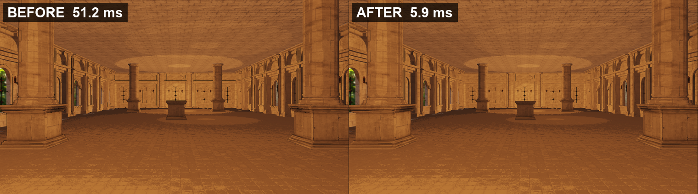

# Alice Engine — 렌더링 최적화

DirectX 11 자체 엔진 [Alice Engine](https://github.com/Chang-Jin-Lee/AliceEngine)의 렌더링 병목을 다시 분석하고 고친 개인 후속 작업입니다.
팀 프로젝트가 끝난 뒤 혼자 진행했습니다.

| 최적화 이전 | 최적화 이후 |
|:---:|:---:|
| [](https://youtu.be/Lpzut2vAQ0I) | [](https://youtu.be/R-COueGVNMA) |

썸네일을 누르면 유튜브로 넘어갑니다. 화면 우측 상단 HUD에 프레임 시간과 패스별 GPU 시간, 드로우콜, 업로드량이 실시간으로 찍히고, 배지의 `[LEGACY ON]`과 `[CURRENT]`로 어느 경로인지 알 수 있습니다. 원본 파일은 [`Docs/media/`](Docs/media)에 있습니다.



위 두 장은 벤치 실행에서 뽑은 **같은 프레임, 같은 카메라 위치**입니다. 화면은 똑같은데 GPU 시간이 51.2 ms에서 5.9 ms로 줄었습니다.

---

## 결과

RTX 4060 Ti · 1920×1080 · vsync off · Release · 같은 카메라 경로 598프레임 평균

| 항목 | 이전 | 이후 | 배수 |
|---|---|---|---|
| **GPU 시간** | 51.21 ms | **5.88 ms** | **8.7배** |
| 메인 패스 GPU | 50.95 ms | 5.80 ms | 8.8배 |
| GPU 1% low | 62.33 ms | 6.69 ms | 9.3배 |
| 본 상수 버퍼 업로드 | 605 MB / 프레임 | **451 KB / 프레임** | **1341배** |
| 드로우콜 | 10,853 | 6,700 | 1.6배 |
| 인스턴스 드로우 | 0 | 57 | |

개선 폭의 대부분은 본 상수 버퍼 한 줄에서 나옵니다. 프레임마다 605MB를 올리던 것이 451KB가 됐습니다.

---

## 병목 찾기

배경 타일이 깔린 장면을 RenderDoc으로 캡처했습니다. 타일은 13 × 26, 338장입니다. 여기서 걸린 것이 셋이었습니다.

| 발견 | 내용 |
|---|---|
| 드로우콜 3중 계상 | GBuffer에서 그린 불투명 오브젝트를 TransparentForward가 다시 그렸습니다. 기본 `outlineWidth`가 0이 아니어서 아웃라인 패스가 또 한 번 그렸습니다 |
| 정적 타일이 스키닝 경로로 | 움직이지도 않는 배경 타일에 `BLENDINDICES` / `BLENDWEIGHT`가 붙어 스키닝 경로를 탔습니다. 드로우마다 64KB 본 상수 버퍼를 Map/Unmap 했습니다 |
| 인스턴싱 미적용 | 인스턴싱 조건이 `boneCount == 1`이라 `boneCount == 0`인 타일은 전부 탈락했습니다. 같은 메시 수백 장을 개별 드로우로 냈습니다 |

## 수정

| | |
|---|---|
| 알파 렌더링 경로 정리 | 불투명과 투명을 나눠 필터링해 TransparentForward의 재렌더를 제거 |
| 아웃라인 기본값 | `outlineWidth` 기본값을 0으로 내려 전 오브젝트 2배 드로우 제거 |
| GPU 인스턴싱 | 인스턴싱 조건을 `boneCount == 0`까지 완화해 정적 타일이 인스턴싱을 타도록 |
| 본 상수 버퍼 | 항상 1023개를 채우던 것을 실제 본 수만큼만 |
| 월드 행렬 | 오브젝트마다 하던 힙 할당 제거 |
| 애니메이션 | 정지한 포즈의 매 프레임 재계산 생략 |
| 카메라 행렬 | 호출마다 재계산하던 것을 dirty 플래그로 캐싱 |

그림자 캐스터를 카메라 프러스텀으로 컬링하던 버그도 함께 고쳤습니다. 화면 밖 물체가 섀도우맵에서 빠져 실내에서 이동하면 그림자가 사라지던 문제로, 기준을 라이트 볼륨으로 바꿨습니다. 정확성 수정이라 비용은 오히려 0.16 ms 늘었습니다.

---

## 측정 방법

빨라졌다는 주장은 조건이 어긋나는 순간 무너집니다. 그래서 셋을 묶어 고정했습니다.

**계측 계층.** D3D11 타임스탬프 쿼리로 패스별 GPU 시간을, 파이프라인 통계 쿼리로 드로우콜과 PS 호출, 정점 수를 모읍니다.

**런타임 토글.** `F10` 한 번이면 최적화 이전 경로로 돌아갑니다. 두 빌드를 비교하는 게 아니라 한 빌드 안에서 경로만 바꿉니다. 되살린 항목마다 코드에 `OPTIMIZATION_REPORT` ID 주석을 남겼습니다.

**카메라 테이크 재생.** 사람이 한 번 비행한 경로를 파일로 남기고, 양쪽 실행이 그 파일을 그대로 재생합니다. 시간이 아니라 프레임 인덱스로 진행하므로 두 실행의 프레임 번호가 어긋나지 않습니다.

두 CSV 모두 워밍업을 뺀 frame 302~899, 598줄로 같게 나왔습니다.

### 재현

```batch
Scripts\record_take.bat     :: 카메라 경로를 한 번 녹화
Scripts\run_bench.bat       :: legacy / current 각 2회, CSV와 PNG 생성
```

`run_bench.bat`이 `--vsync=off --debug-draw=off --width=1920 --height=1080`을 고정합니다.
계측용 실행과 PNG 덤프 실행을 분리해 돌립니다. PNG 덤프가 프레임 시간을 왜곡하기 때문입니다.

---

## 남은 한계

프레임 시간은 GPU 기준으로 읽어야 합니다. 최적화 이후 실행이 창모드 표시 경로에서 60fps 상한에 걸리는 탓에, 프레임 시간으로 재면 개선 폭이 실제보다 작게 나옵니다.

`presentMs`는 엔진의 델타 타임 클램프 때문에 100ms에서 포화됩니다. 지표로 쓰지 않았습니다.

드로우콜과 PS 호출은 미리 정해둔 게이트(2.0배, 1.5배)를 넘지 못했습니다. 최적화 이전 경로에서 늘어난 드로우가 대부분 깊이 테스트에서 걸러져 픽셀 작업까지 가지 않기 때문입니다. 임계값을 낮추지 않고 실측값을 위 표에 그대로 실었습니다.

---

## 빌드

```batch
Build.bat
```

Windows 10/11, Visual Studio 2019 / 2022 / 2026, vcpkg가 필요합니다.
여러 VS가 깔려 있으면 어느 것으로 빌드할지 물어봅니다. `Build.bat 2026`처럼 인자로 지정할 수도 있습니다.
CMake는 없으면 선택한 VS의 번들을 쓰거나 winget으로 설치합니다.

생성되는 솔루션은 `build/AliceRenderer.sln`(2022) 또는 `.slnx`(2026)입니다.

---

## ECS 구조 검증

컴포넌트를 한 곳에 모아 순회하는 구조가 실제로 유리한지 같은 워크로드로 재봤습니다. `step` 격차는 데이터가 전부 L1에 들어가는 N=100에서도 이미 약 3배인데, 이건 캐시가 아니라 간접 참조와 가상 호출 비용입니다.

캐시가 만드는 몫은 그 위에 규모와 파편화로 붙는 증분이고, N=50000에서는 파편화 상태에서 8배 가까이 벌어집니다. 하드웨어 캐시 카운터로 다시 재도 같은 방향이 나왔습니다.

→ [ECS vs GameObject-Component 측정](Docs/ECS_VS_OOP.md)

---

## 원본 저장소

엔진 구조와 이 엔진으로 만든 게임은 원본 저장소에 있습니다.

- [Chang-Jin-Lee/AliceEngine](https://github.com/Chang-Jin-Lee/AliceEngine) — 4인 공동 개발. 제 커밋이 836개로 전체 1,248개 중 67%입니다
- [TEAM-EGOSIS/EGOSIS](https://github.com/TEAM-EGOSIS/EGOSIS) — 이 엔진으로 만든 3인칭 액션 게임

<p align="center">
  <sub>C++20 · Direct3D 11 · HLSL</sub>
</p>
