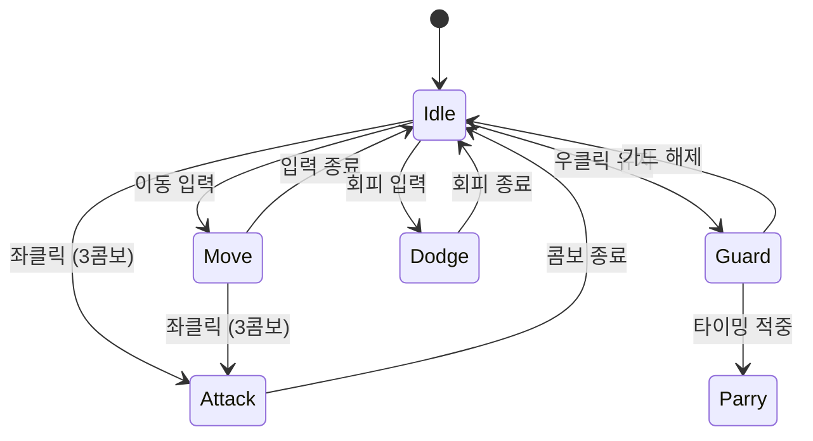

# Alice Engine — 프로젝트 종료 후 개인 렌더링 최적화

> 팀 프로젝트가 끝난 뒤 혼자 이어서 만든 저장소입니다.
>
> C++와 Direct3D 11로 만든 자체 엔진 Alice Engine의 렌더링 경로를 RenderDoc으로 다시 뜯어봤습니다.
> 병목을 찾아 고치고, 계측 계층과 A/B 벤치마크를 직접 붙여 얼마나 빨라졌는지 숫자로 확인했습니다.
>
> ## GPU 51.21 ms → 5.88 ms, 8.7배
>
> 본 상수 버퍼 업로드는 605 MB에서 451 KB로 줄었습니다. 같은 카메라 경로 598프레임 평균입니다.
>
> [→ 렌더링 최적화 상세](#렌더링-최적화--측정으로-검증한-87배)

| | |
|---|---|
| 원본 엔진 (팀 개발) | [Chang-Jin-Lee/AliceEngine](https://github.com/Chang-Jin-Lee/AliceEngine). 4인이 함께 만들었고 제 커밋이 836개로 전체 1,248개 중 67%입니다 |
| 이 저장소 (개인 후속) | 프로젝트가 끝난 뒤 혼자 진행했습니다. 병목 분석, 렌더 패스 정리, GPU 인스턴싱, 상수 버퍼 최적화, 계측과 벤치마크 구축 |


---

## Project Snapshot

| 항목 | 내용 |
|---|---|
| 저장소 성격 | 팀 프로젝트가 끝난 뒤 혼자 이어간 후속 개발 |
| 개선 결과 | GPU 51.21 ms → 5.88 ms (8.7배), 본 상수 버퍼 업로드 1341배 감소 |
| 검증 방법 | 런타임 legacy 토글, 카메라 테이크 재생, 프레임별 CSV 계측 |
| 플랫폼 | Windows (Win32, Direct3D 11) |
| 엔진 | Alice Engine. 직접 만들었고 C++20, 엔진 코어가 약 99,000줄입니다 |
| 기술 스택 | `C++20` `Direct3D 11` `HLSL` `NVIDIA PhysX` `RTTR` `Assimp` `FMOD` `Dear ImGui` `CMake/vcpkg` |
| 원본 팀 프로젝트 | 2026.01.16 ~ 2026.02.13, 약 3주. 8명이었고 프로그래머 4명, 아티스트 2명, 기획 2명. 제가 팀 리더였습니다 |

---

## 렌더링 최적화 — 측정으로 검증한 8.7배

이 저장소에서 가장 크게 손본 부분입니다. 빨라진 것 같다는 인상만으로는 부족해서, 같은 장면을 두 번 재생해 숫자로 비교했습니다.

### 병목 찾기

배경 타일이 깔린 장면을 RenderDoc으로 캡처했습니다. 타일은 13 × 26, 338장입니다. 여기서 걸린 것이 셋이었습니다.

| 발견 | 내용 |
|---|---|
| 드로우콜 3중 계상 | GBuffer에서 그린 불투명 오브젝트를 TransparentForward가 다시 그렸습니다. 기본 `outlineWidth`가 0이 아니어서 아웃라인 패스가 또 한 번 그렸습니다 |
| 정적 타일이 스키닝 경로로 | 움직이지도 않는 배경 타일에 `BLENDINDICES` / `BLENDWEIGHT`가 붙어 스키닝 경로를 탔습니다. 드로우마다 64KB 본 상수 버퍼를 Map/Unmap 했습니다 |
| 인스턴싱 미적용 | 인스턴싱 조건이 `boneCount == 1`이라 `boneCount == 0`인 타일은 전부 탈락했습니다. 같은 메시 수백 장을 개별 드로우로 냈습니다 |

### 수정

불투명과 투명을 나눠서 필터링하고, 아웃라인 기본값을 0으로 내리고, 인스턴싱 조건을 완화했습니다. 여기에 본 상수 버퍼를 실제 본 수만큼만 채우기, 월드 행렬 계산의 힙 할당 제거, 정지한 포즈의 재계산 생략, 카메라 행렬 캐싱을 붙였습니다.

### 비교 조건 고정

빨라졌다는 주장은 조건이 어긋나는 순간 무너집니다. 그래서 셋을 묶어 고정했습니다.

- 계측 계층. D3D11 타임스탬프 쿼리로 패스별 GPU 시간을, 파이프라인 통계 쿼리로 드로우콜과 PS 호출, 정점 수를 모읍니다
- 런타임 토글. `F10` 한 번이면 최적화 이전 경로로 돌아갑니다. 두 빌드를 비교하는 게 아니라 한 빌드 안에서 경로만 바꿉니다
- 카메라 테이크 재생. 사람이 한 번 비행한 경로를 파일로 남기고, 양쪽 실행이 그 파일을 그대로 재생합니다. 시간이 아니라 프레임 인덱스로 진행하므로 두 실행의 프레임 번호가 어긋나지 않습니다

두 CSV 모두 워밍업을 뺀 frame 302~899, 598줄로 같게 나왔습니다.

### 결과

RTX 4060 Ti · 1920×1080 · vsync off · Release · 598프레임 평균

| 항목 | 최적화 이전 | 최적화 이후 | 배수 |
|---|---|---|---|
| GPU 시간 | 51.21 ms | **5.88 ms** | **8.7배** |
| 메인 패스 GPU | 50.95 ms | 5.80 ms | 8.8배 |
| GPU 1% low | 62.33 ms | 6.69 ms | 9.3배 |
| 드로우콜 | 10,853 | 6,700 | 1.6배 |
| 인스턴스 드로우 | 0 | 57 | |
| 본 상수 버퍼 업로드 | 605 MB / 프레임 | **451 KB / 프레임** | **1341배** |

프레임마다 605MB를 올리던 것이 451KB가 됐습니다. 개선 폭의 대부분은 이 한 줄에서 나옵니다.

### 영상

| | 파일 |
|---|---|
| 최적화 이전 | [`Docs/media/before_legacy.mp4`](Docs/media/before_legacy.mp4) |
| 최적화 이후 | [`Docs/media/after_current.mp4`](Docs/media/after_current.mp4) |

화면 우측 상단 HUD에 프레임 시간과 패스별 GPU 시간, 드로우콜, 업로드량이 실시간으로 찍힙니다. 배지에 `[LEGACY ON]`과 `[CURRENT]`가 표시되니 어느 경로인지는 영상만 봐도 알 수 있습니다.

### 남은 한계

프레임 시간은 GPU 기준으로 읽어야 합니다. 최적화 이후 실행이 창모드 표시 경로에서 60fps 상한에 걸리는 탓에, 프레임 시간으로 재면 개선 폭이 실제보다 작게 나옵니다.

`presentMs`는 엔진의 델타 타임 클램프 때문에 100ms에서 포화됩니다. 지표로 쓰지 않았습니다.

드로우콜과 PS 호출은 미리 정해둔 게이트(2.0배, 1.5배)를 넘지 못했습니다. 최적화 이전 경로에서 늘어난 드로우가 대부분 깊이 테스트에서 걸러져 픽셀 작업까지 가지 않기 때문입니다. 임계값을 낮추지 않고 실측값을 위 표에 그대로 실었습니다.

---

## Alice Engine 구조

게임은 팀이 직접 만든 자체 엔진(Alice Engine) 위에서 동작합니다.

```
┌─────────────────────────────────────────────────────┐
│  Editor Layer    ImGui 에디터 · 인스펙터 · 뷰포트       │
├─────────────────────────────────────────────────────┤
│  Runtime Layer   ECS · 스크립팅 · 물리 · 애니메이션     │
├─────────────────────────────────────────────────────┤
│  Rendering Layer D3D11 · Toon PBR · 카메라 · 쉐도우   │
├─────────────────────────────────────────────────────┤
│  Foundation      리소스 · 직렬화 · 입력 · 오디오        │
└─────────────────────────────────────────────────────┘
```

| 서브시스템 | 내용 |
|---|---|
| **ECS** | Sparse Set 기반 World / ComponentRegistry, Unity 스타일 GameObject 래퍼 |
| **렌더링** | Forward + Deferred 이중 경로, Toon PBR, Shadow Map (PCF), Post-Process Volume |
| **물리** | NVIDIA PhysX 래퍼 — RigidBody, Collision, Joint, Ragdoll |
| **애니메이션** | FBX 스켈레탈, 루트모션, 블렌딩, AnimBlueprint 상태머신, 소켓 어태치 |
| **스크립팅** | C++ 핫리로드 DLL (AliceScripts), RTTR 리플렉션으로 인스펙터 연동 |
| **오디오** | FMOD 기반 3D 공간음향, 이벤트 드리븐 SFX / BGM |
| **VFX** | 파티클, 트레일, 컴퓨트 이펙트, 데칼 시스템 |
| **UI** | 셰이더 기반 AliceUI 렌더러 (게임용), Dear ImGui (에디터용) |
| **에디터** | Hierarchy / Inspector / Project 브라우저 / 머티리얼 에디터 / AnimBlueprint 에디터 / Undo-Redo |

---

## 이 엔진으로 만든 게임 — EGOSIS

엔진이 실제로 게임을 돌린다는 증거입니다. 아래는 원본 팀 프로젝트(2026.01~02)에서 나온 결과물입니다.
저는 팀 리더 프로그래머로 카메라와 락온, 애니메이션 블렌딩, Toon PBR 렌더링, 프로토타입 조립,
빌드와 Git 운영을 맡았습니다. 이 저장소의 최적화는 게임이 완성된 뒤에 시작했습니다.

### 게임 소개

캐릭터 **티아(Tia)** 가 에고웨폰(낫)을 들고 단일 보스와 싸우는 3인칭 액션 게임입니다.  
소울라이크 장르 특유의 **모션 읽기 → 패링 / 가드 → 반격 → 콤보** 전투 루프를 중심으로 설계했으며, Toon PBR 셰이딩으로 캐릭터와 배경이 또렷하게 분리되는 비주얼을 목표로 했습니다.

### 전투 액션

| 액션 | 설명 |
|---|---|
| **패링** | 보스 공격 타이밍에 맞춰 반격 기회를 열기 |
| **가드** | 피해를 감소시키는 방어 자세 |
| **회피 (구르기)** | 무적 판정이 있는 회피 이동 |
| **3콤보 공격** | 연속 좌클릭으로 이어지는 콤보 체인 |
| **차징 강공격** | 천천히 모았다가 내리치는 고대미 일격 |
| **락온** | 보스를 화면 중심에 고정해 전투 가독성 확보 |
| **그로기 / 무기 파괴** | 보스 무기를 부수면 그로기 상태로 전환, 실행 공격 가능 |

---

### 주요 시스템 (내 담당)

#### 카메라 · 락온

소울라이크 전투는 보스의 모션을 놓치지 않는 시점이 핵심입니다.  
락온 타겟을 스프링암으로 추적하고, 타격·이벤트에 따른 카메라 셰이크를 더했습니다.  
포효·컷씬 연출 중에도 락온 상태를 유지하도록 **연출과 전투 상태를 별도 경로로 분리**했습니다.

```
플레이어 락온 입력
  └─ CameraSystem: 타겟 = 보스
       ├─ 매 프레임: 스프링암 거리 보정 + 셰이크
       └─ 포효 연출 발생 → 락온 상태는 독립 유지
```

#### Toon PBR 렌더링 · 셰이더

Direct3D 11 기반 Forward / Deferred 이중 렌더링 경로 위에서 **자체 Toon PBR 셰이딩**을 구현했습니다.  
Lambert, Phong, Blinn-Phong, Toon, PBR, **Toon PBR**, OnlyTexture 등 셰이딩 모드를 머티리얼 파라미터로 전환할 수 있으며, Sobel 엣지 디텍션으로 Deferred 아웃라인을 더했습니다.

```
머티리얼 파라미터 → Toon PBR 셰이더 → 톤매핑 / 포스트프로세스 → 화면 출력
                                       └─ Deferred Sobel 아웃라인
```

#### 애니메이션 블렌딩 · FBX 파이프라인

믹사모 → FBX → 블렌더 파이프라인으로 클립을 분리·정리하고, 상태 전이에 **블렌딩과 루트모션**을 연결했습니다.  
Idle·이동·공격·가드·회피가 끊김 없이 이어지도록 전이 시간과 재생 속도를 조정했습니다.



#### 프로토타입 조립 · 빌드 / Git 관리

전투·물리·UI·VFX를 각자 작업한 모듈을 **주기적인 통합 빌드**로 조립해 회의 직후 팀 PC에 배포했습니다.  
Git 컨벤션·LFS·서브모듈을 운영해 협업 충돌을 줄이고, 전투용·UI용 2종 빌드를 유지했습니다.

---

### 개발 중 해결한 주요 문제

#### 포효 연출에서 락온이 풀렸다

보스의 포효 연출이 락온 상태를 강제로 해제하던 흐름을 분리해, 연출 중에도 타겟 고정이 유지되도록 수정했습니다.  
**"연출 재생"과 "전투 입력 상태"를 같은 경로에서 처리하면 한쪽이 다른 쪽을 의도치 않게 끈다**고 보고, 락온 상태를 연출과 독립적으로 관리했습니다.

#### 평타 한 대를 쳐야 카메라가 반응했다

카메라 활성 조건이 "공격 입력"에 묶여 있던 것을 "커서 상태"로 옮겨, 전투 전에도 시점을 잡을 수 있게 했습니다.  
줌에 상·하한을 두어 카메라가 캐릭터 안으로 파고드는 문제도 함께 수정했습니다.

#### 흩어진 모듈을 하나의 플레이 빌드로 합쳐야 했다

"각자 잘 도는 것"과 "합쳐서 도는 것"은 다르다고 보고, 통합 빌드를 자주 만들어 일찍 문제를 드러내는 쪽을 택했습니다.  
프로토타입 메인 씬을 기준으로 모듈을 조립하고, 전투용·UI용 빌드 2종을 회의 직후 팀 PC에 배포했습니다.

#### 막바지 셰이딩 결정

신규 기능 추가가 금지된 최종 주차에 셰이딩 방식을 당일 확정해야 했습니다.  
"더 좋은 그림"보다 "마감 안에 안정적으로 나오는 그림"을 택해, 이미 갖춰진 Toon PBR을 다듬는 방향으로 위험을 줄였습니다.

---

## 빌드 방법

### 요구사항

- Windows 10/11
- Visual Studio 2019 / 2022 / 2026 (C++ 데스크톱 개발 워크로드)
  - 여러 버전이 깔려 있으면 `Build.bat`이 실행 시 어느 것으로 빌드할지 물어봅니다.
  - 묻지 않고 지정하려면 `Build.bat 2026` 처럼 연도나 목록 번호를 인자로 넘기면 됩니다.
- CMake 3.20+ (없으면 Build.bat이 선택한 VS의 번들을 쓰거나 winget으로 자동 설치)
- Git (서브모듈 포함)
- vcpkg (`C:\vcpkg` 또는 `D:\vcpkg`, 또는 `VCPKG_ROOT` 환경변수)

### 빌드

```batch
Build.bat
```

1. Git 서브모듈 업데이트
2. vcpkg로 라이브러리 설치 (DirectXTK, DirectXTex, Assimp, PhysX)
3. Visual Studio 선택 (설치된 것이 하나면 자동)
4. CMake로 VS 솔루션 생성 → `build/AliceRenderer.sln*`

### 솔루션 구성

| 솔루션 | 용도 |
|---|---|
| `build/AliceRenderer.sln*` | 에디터(`Launch`) / 게임(`AlicePlayer`) 빌드 |
| `EngineSource/ScriptsBuild/build/AliceUserScripts.sln*` | 게임 스크립트 핫리로드 DLL 빌드 |

솔루션 확장자는 빌드에 쓴 Visual Studio를 따라갑니다. 2022는 `.sln`, 2026은 새 XML 포맷인
`.slnx`를 생성합니다. `Build.bat`이 마지막에 실제 생성된 파일 경로를 출력하니 그대로 열면 됩니다.

---

## 팀 구성

| 파트 | 인원 | 주요 담당 |
|---|---|---|
| 프로그래밍 (본인, 팀 리더) | 1 | 카메라·락온, 애니메이션·블렌딩, 렌더링·Toon PBR, 프로토타입 조립, 빌드/Git |
| 프로그래밍 | 3 | 전투·판정·FSM·물리, UI·사운드·이펙트, 포스트프로세스·보스 패턴·맵 배치 |
| 아트 | 2 | 캐릭터·보스 모델링, 애니메이션, 배경·환경 아트 |
| 기획 | 2 | 전투 설계, QA, 게임 흐름 |

### 협업 방식

- 매주 월요일 정기회의 (1주차 ~ 최종주차, 전원 참석)
- QA 리스트 70+ 항목으로 버그·요청 추적
- 코드: Git (컨벤션·LFS·서브모듈) / 산출물: SVN 병행
- 전투용·UI용 통합 빌드 2종을 회의 직후 팀 PC에 배포

---

## 배운 점

기능을 빠르게 붙이는 것보다, 기능이 **"언제·어디서 실행되는가"를 통제하는 일**이 더 중요했습니다.  
락온이 연출에 풀리거나 카메라 활성 조건이 공격 입력에 묶인 문제처럼, 상태와 트리거를 분리하는 것만으로 많은 버그가 사라졌습니다.

3주라는 짧은 일정에서는 **"더 좋은 기능"보다 "마감 안에 안정적으로 도는 빌드"** 를 택하는 판단이 결과적으로 완성도를 지켜 주었습니다.  
팀 리더로서 통합 빌드를 자주 만들고 버전 관리 기준을 단일화하니, 합치는 단계에서 터지는 문제를 일찍 발견할 수 있었습니다.

---

<p align="center">
  <sub>Alice Engine · EGOSIS · 팀명 "낫놓고 게임즈" · 2026</sub>
</p>
